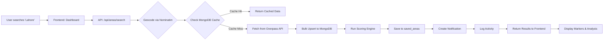

<div align="center">

# 🌍 UrbanPulse

### Geospatial Database for Urban Planning

*Enterprise-grade MERN platform for real-time urban infrastructure analysis, planning, and reporting*

[](https://www.mongodb.com/)
[](https://react.dev/)
[](https://nodejs.org/)
[](https://expressjs.com/)
[](https://www.openstreetmap.org/)
[](https://vitejs.dev/)
[](https://tailwindcss.com/)
[](LICENSE)

[Features](#-key-features) • [Quick Start](#-quick-start) • [Architecture](#-architecture) • [API Docs](#-api-reference) • [Tech Stack](#-technology-stack)

</div>

---

## 📋 Overview

**UrbanPulse** transforms raw geospatial data into actionable urban planning intelligence. Search any area worldwide, analyze infrastructure coverage, design urban layouts, generate PDF reports, and collaborate on infrastructure proposals — all with persistent MongoDB storage and real-time OpenStreetMap integration.

### 🎯 What Makes UrbanPulse Special?

- 🌐 **Global Coverage** - Analyze any location worldwide using OpenStreetMap data
- 💾 **Smart Caching** - Redis-powered caching for lightning-fast repeated queries
- 🎨 **Modern UI** - Glassmorphism design with dark theme and smooth animations
- 🔐 **Secure** - JWT authentication with role-based access control (RBAC)
- 📊 **Data-Driven** - Advanced scoring algorithms for urban planning decisions
- 🚀 **Production Ready** - Deployed on Vercel with MongoDB Atlas integration

---

## ✨ Key Features

## ✨ Key Features

<table>
<tr>
<td width="50%">

### 🗺️ Interactive Mapping
- **Leaflet-based** dark-themed map interface
- **Dynamic markers** with clustering
- **Coverage circles** for facility analysis
- **Real-time** data visualization
- **Custom layers** with GeoJSON support

### 📐 Urban Planning Tools
- **Drag-and-drop** element placement
- **Distance analysis** between facilities
- **Rule-based feedback** system
- **Design versioning** and history
- **Collaborative** workspace management

### 📊 Analytics & Insights
- **Weighted scoring** algorithm
- **Infrastructure gap** detection
- **Population density** analysis
- **Coverage heatmaps**
- **Comparative analysis** tools

</td>
<td width="50%">

### 💾 Data Management
- **18 MongoDB collections** with 2dsphere indexes
- **Full persistence** of searches and designs
- **Redis caching** for performance
- **Activity tracking** and audit trails
- **Bookmark system** for favorites

### 📄 Reporting & Export
- **Auto-generated PDF** reports with PDFKit
- **Customizable templates**
- **Score breakdowns** and recommendations
- **Download history** management
- **Shareable reports**

### 🔔 Collaboration Features
- **In-app notifications** with real-time polling
- **Infrastructure proposals** with voting
- **Project workspaces** for team collaboration
- **Role-based access** (Admin/Planner/Viewer)
- **Activity feeds** and user tracking

</td>
</tr>
</table>

---

## 🏗️ Architecture

```
┌─────────────────────────────────────────────────────────────┐
│                    Frontend (React + Vite)                    │
│  ┌──────────┐  ┌──────────┐  ┌──────────┐  ┌──────────┐    │
│  │Dashboard │  │ Planner  │  │Analytics │  │7 New Pages│    │
│  │(Leaflet) │  │(Drag/Drop)│  │(Charts)  │  │(CRUD)     │    │
│  └─────┬────┘  └─────┬────┘  └─────┬────┘  └─────┬────┘    │
│        └──────────────┴─────────────┴─────────────┘          │
│                    mapsApi.js (fetch wrapper)                 │
└────────────────────────────┬────────────────────────────────┘
                             │ HTTP/JSON
┌────────────────────────────┴────────────────────────────────┐
│                 Backend (Express.js + Node 18)               │
│  ┌──────────┐  ┌──────────┐  ┌──────────┐  ┌──────────┐    │
│  │Auth MW   │  │22 Routes │  │Services  │  │Middleware│    │
│  │(JWT+RBAC)│  │(REST API)│  │(OSM,Cache)│  │(Error)   │    │
│  └──────────┘  └──────────┘  └──────────┘  └──────────┘    │
└────────────────────────────┬────────────────────────────────┘
          ┌──────────────────┼──────────────────┐
          ▼                  ▼                  ▼
   ┌─────────────┐   ┌─────────────┐   ┌─────────────┐
   │  MongoDB    │   │ Nominatim   │   │  Overpass   │
   │ 18 Collections│  │ (Geocoding) │   │  (Places)   │
   │ + 2dsphere  │   └─────────────┘   └─────────────┘
   └─────────────┘
```

## 🗄️ Database Schema

UrbanPulse uses **18 MongoDB collections** with geospatial indexing for optimal performance.

<details>
<summary><b>📊 View Complete Schema (18 Collections)</b></summary>

| # | Collection | Purpose | Key Fields |
|---|---|---|---|
| 1️⃣ | `users` | Authentication & authorization | `email`, `password`, `role` (admin/planner/viewer) |
| 2️⃣ | `landmarks` | POIs from OSM + user-created | `name`, `type`, `geometry` (Point), `city` |
| 3️⃣ | `roads` | Road network data | `name`, `road_type`, `geometry` (LineString), `length_km` |
| 4️⃣ | `zones` | Administrative boundaries | `name`, `zone_type`, `geometry` (Polygon), `area_sqkm` |
| 5️⃣ | `utilities` | Infrastructure (water, electricity) | `type`, `geometry`, `capacity`, `status` |
| 6️⃣ | `populationdatas` | Census & demographic data | `zone_id`, `population_count`, `household_count`, `growth_rate` |
| 7️⃣ | `saved_areas` | User search history | `user_id`, `area_name`, `center`, `cached_score` |
| 8️⃣ | `analytics_results` | Full analysis snapshots | `area_id`, `scores`, `recommendations`, `timestamp` |
| 9️⃣ | `planner_designs` | Urban layout designs | `user_id`, `design_name`, `elements[]`, `metadata` |
| 🔟 | `reports` | PDF report metadata | `user_id`, `area_id`, `file_path`, `generated_at` |
| 1️⃣1️⃣ | `city_profiles` | Cached city data from Nominatim | `name`, `country`, `bbox`, `search_count` |
| 1️⃣2️⃣ | `activity_logs` | User action audit trail | `user_id`, `action`, `details`, `timestamp` |
| 1️⃣3️⃣ | `notifications` | In-app messages | `user_id`, `message`, `type`, `read`, `created_at` |
| 1️⃣4️⃣ | `project_workspaces` | Grouped workspaces | `user_id`, `name`, `areas[]`, `designs[]`, `reports[]` |
| 1️⃣5️⃣ | `area_comparisons` | Side-by-side comparisons | `user_id`, `areas[]`, `comparison_results` |
| 1️⃣6️⃣ | `infrastructure_requests` | Community proposals | `user_id`, `type`, `location`, `votes`, `status` |
| 1️⃣7️⃣ | `bookmarks` | User favorites | `user_id`, `item_type`, `item_id`, `created_at` |
| 1️⃣8️⃣ | `map_layers` | Custom GeoJSON layers | `user_id`, `name`, `geojson`, `style`, `visibility` |

**Geospatial Indexes:**
- `landmarks`: 2dsphere index on `geometry`
- `roads`: 2dsphere index on `geometry`
- `zones`: 2dsphere index on `geometry`
- `utilities`: 2dsphere index on `geometry`

</details>

---

## 🚀 Quick Start

### Prerequisites

Before you begin, ensure you have the following installed:

- **Node.js** v18 or higher ([Download](https://nodejs.org/))
- **MongoDB** v5.0+ ([Download](https://www.mongodb.com/try/download/community) or use [MongoDB Atlas](https://www.mongodb.com/cloud/atlas))
- **Git** ([Download](https://git-scm.com/downloads))
- **npm** or **pnpm** (comes with Node.js)

### 📥 Installation

**1️⃣ Clone the Repository**

```bash
git clone https://github.com/Hassan136-nust/Geo-Spatial-Database-for-Urban-Planning-.git
cd Geo-Spatial-Database-for-Urban-Planning-
```

**2️⃣ Install Dependencies**

```bash
# Install frontend dependencies (root directory)
npm install

# Install backend dependencies
cd server
npm install
cd ..
```

**3️⃣ Environment Configuration**

Create a `.env` file in the `server` directory:

```bash
# server/.env
PORT=5000
MONGO_URI=mongodb://127.0.0.1:27017/urbanpulse
JWT_SECRET=your_super_secret_jwt_key_change_in_production
JWT_EXPIRE=30d
NODE_ENV=development

# Optional: Redis Configuration (for caching)
REDIS_HOST=localhost
REDIS_PORT=6379
```

> 💡 **Tip:** For production, use MongoDB Atlas and update `MONGO_URI` accordingly.

**4️⃣ Seed Database (Optional)**

Populate the database with demo users:

```bash
cd server
node seed/seedData.js
```

**Demo Accounts:**
| Role | Email | Password |
|------|-------|----------|
| 👑 Admin | `admin@urbanpulse.pk` | `admin123` |
| 🏗️ Planner | `planner@urbanpulse.pk` | `planner123` |
| 👁️ Viewer | `viewer@urbanpulse.pk` | `viewer123` |

**5️⃣ Start Development Servers**

<details>
<summary><b>🪟 Windows (Recommended)</b></summary>

Double-click `run_project.bat` in the root directory. This will automatically start both servers.

</details>

<details>
<summary><b>🍎 macOS / 🐧 Linux</b></summary>

Open **two separate terminals**:

**Terminal 1 - Backend:**
```bash
cd server
npm run dev
```

**Terminal 2 - Frontend:**
```bash
npm run dev
```

</details>

**6️⃣ Open the Application**

Navigate to **[http://localhost:5173](http://localhost:5173)** in your browser.

✅ **You're all set!** Login with one of the demo accounts and start exploring.

---

## 📡 API Reference

### 🔐 Authentication Endpoints

<details>
<summary><b>View Authentication APIs</b></summary>

| Method | Endpoint | Auth | Description |
|--------|----------|------|-------------|
| `POST` | `/api/auth/register` | — | Register new user account |
| `POST` | `/api/auth/signup` | — | Alias for register |
| `POST` | `/api/auth/login` | — | Login and receive JWT token |
| `GET` | `/api/auth/me` | 🔒 | Get current user profile |
| `PUT` | `/api/auth/profile` | 🔒 | Update user profile |
| `PUT` | `/api/auth/password` | 🔒 | Change password |

</details>

### 🗺️ Areas & Search

<details>
<summary><b>View Area APIs</b></summary>

| Method | Endpoint | Auth | Description |
|--------|----------|------|-------------|
| `POST` | `/api/areas/search` | 🔒* | Search area → geocode → analyze → persist |
| `GET` | `/api/areas/history` | 🔒 | Get user's saved search history |
| `GET` | `/api/areas/:id` | — | Get saved area with analytics |
| `DELETE` | `/api/areas/:id` | 🔒 | Delete saved area |

*Optional auth - public search allowed, but requires auth for persistence

</details>

### 🏗️ Planner & Designs

<details>
<summary><b>View Planner APIs</b></summary>

| Method | Endpoint | Auth | Description |
|--------|----------|------|-------------|
| `POST` | `/api/planner/save` | 🔒 | Save or update design |
| `GET` | `/api/planner/user-designs` | 🔒 | Get all user designs |
| `GET` | `/api/planner/:id` | 🔒 | Get single design details |
| `PUT` | `/api/planner/:id` | 🔒 | Update existing design |
| `DELETE` | `/api/planner/:id` | 🔒 | Delete design |

</details>

### 📄 Reports & PDF Generation

<details>
<summary><b>View Report APIs</b></summary>

| Method | Endpoint | Auth | Description |
|--------|----------|------|-------------|
| `POST` | `/api/report/generate` | — | Generate PDF report for area |
| `GET` | `/api/report/history` | 🔒 | Get user's report history |
| `GET` | `/api/report/:id/download` | 🔒 | Download saved PDF file |
| `DELETE` | `/api/report/:id` | 🔒 | Delete report |

</details>

### 🔔 Notifications

<details>
<summary><b>View Notification APIs</b></summary>

| Method | Endpoint | Auth | Description |
|--------|----------|------|-------------|
| `GET` | `/api/notifications` | 🔒 | Get notifications (paginated) |
| `GET` | `/api/notifications/unread-count` | 🔒 | Get unread notification count |
| `PUT` | `/api/notifications/:id/read` | 🔒 | Mark notification as read |
| `PUT` | `/api/notifications/read-all` | 🔒 | Mark all notifications as read |

</details>

### 📁 Projects & Workspaces

<details>
<summary><b>View Project APIs</b></summary>

| Method | Endpoint | Auth | Description |
|--------|----------|------|-------------|
| `POST` | `/api/projects` | 🔒 | Create new project workspace |
| `GET` | `/api/projects` | 🔒 | List all user projects |
| `GET` | `/api/projects/:id` | 🔒 | Get project details |
| `PUT` | `/api/projects/:id` | 🔒 | Update project metadata |
| `PUT` | `/api/projects/:id/items` | 🔒 | Add/remove items from project |
| `DELETE` | `/api/projects/:id` | 🔒 | Delete project |

</details>

### 📊 Comparisons & Analytics

<details>
<summary><b>View Comparison APIs</b></summary>

| Method | Endpoint | Auth | Description |
|--------|----------|------|-------------|
| `POST` | `/api/comparisons` | 🔒 | Compare 2+ areas side-by-side |
| `GET` | `/api/comparisons` | 🔒 | List all comparisons |
| `GET` | `/api/comparisons/:id` | 🔒 | Get comparison details |
| `DELETE` | `/api/comparisons/:id` | 🔒 | Delete comparison |

</details>

### 🏗️ Infrastructure Requests

<details>
<summary><b>View Infrastructure Request APIs</b></summary>

| Method | Endpoint | Auth | Description |
|--------|----------|------|-------------|
| `POST` | `/api/infra-requests` | 🔒 | Submit infrastructure proposal |
| `GET` | `/api/infra-requests` | — | List all proposals (filterable) |
| `GET` | `/api/infra-requests/mine` | 🔒 | Get user's proposals |
| `PUT` | `/api/infra-requests/:id/vote` | 🔒 | Upvote or downvote proposal |
| `PUT` | `/api/infra-requests/:id/review` | 🔒🛡️ | Admin review (approve/reject) |

</details>

### 🔖 Bookmarks & Layers

<details>
<summary><b>View Bookmark & Layer APIs</b></summary>

**Bookmarks:**
| Method | Endpoint | Auth | Description |
|--------|----------|------|-------------|
| `POST` | `/api/bookmarks` | 🔒 | Add bookmark |
| `GET` | `/api/bookmarks` | 🔒 | List user bookmarks |
| `DELETE` | `/api/bookmarks/:id` | 🔒 | Remove bookmark |

**Map Layers:**
| Method | Endpoint | Auth | Description |
|--------|----------|------|-------------|
| `POST` | `/api/map-layers` | 🔒 | Create custom layer |
| `GET` | `/api/map-layers` | 🔒 | List user's layers |
| `GET` | `/api/map-layers/public` | — | List public layers |
| `PUT` | `/api/map-layers/:id` | 🔒 | Update layer |
| `DELETE` | `/api/map-layers/:id` | 🔒 | Delete layer |

</details>

### 🏙️ Cities & Activity

<details>
<summary><b>View City & Activity APIs</b></summary>

**Cities:**
| Method | Endpoint | Auth | Description |
|--------|----------|------|-------------|
| `GET` | `/api/cities` | — | List cached city profiles |
| `GET` | `/api/cities/:name` | — | Get city profile + statistics |
| `GET` | `/api/cities/:name/stats` | — | Get aggregated city stats |

**Activity Logs:**
| Method | Endpoint | Auth | Description |
|--------|----------|------|-------------|
| `GET` | `/api/activity` | 🔒 | Get user activity feed |
| `GET` | `/api/activity/stats` | 🔒 | Get activity statistics |

</details>

**Legend:**  
🔒 = Requires JWT token  
🛡️ = Admin role required  
— = Public endpoint

---

## 🧩 Frontend Pages

| Route | Page | Description | Auth Required |
|-------|------|-------------|---------------|
| `/` | 🏠 Home | Landing page with feature showcase | — |
| `/login` | 🔐 Login/Register | JWT authentication portal | — |
| `/dashboard` | 🗺️ Map Dashboard | Interactive map with search & analysis | 🔒 |
| `/planner` | 📐 Urban Planner | Drag-and-drop layout editor | 🔒 |
| `/analytics` | 📊 Analytics | Charts and data visualization | 🔒 |
| `/saved-areas` | 💾 Saved Areas | Search history with cached scores | 🔒 |
| `/my-designs` | 🎨 My Designs | Saved planner layouts | 🔒 |
| `/saved-reports` | 📄 Saved Reports | PDF report history | 🔒 |
| `/projects` | 📁 Projects | Workspace organization | 🔒 |
| `/compare` | ⚖️ Compare Areas | Side-by-side area scoring | 🔒 |
| `/infra-requests` | 🏗️ Proposals | Infrastructure request board | 🔒 |
| `/bookmarks` | 🔖 Bookmarks | Saved favorites | 🔒 |
| `/landmarks` | 📍 Landmarks Manager | Manage landmarks and POIs | 🔒 |
| `/profile` | 👤 Profile | User settings and preferences | 🔒 |
| `/admin` | 🛡️ Admin Panel | User management dashboard | 🔒 Admin |
| `/system-status` | 🔧 System Status | Health monitoring and diagnostics | 🔒 Admin |

---

## 🔧 Technology Stack

### Frontend
| Technology | Version | Purpose |
|------------|---------|---------|
| ⚛️ **React** | 18.3.1 | UI framework with hooks |
| ⚡ **Vite** | 6.4.2 | Build tool and dev server |
| 🎨 **Tailwind CSS** | 4.1.12 | Utility-first styling |
| 🗺️ **Leaflet** | 1.9.4 | Interactive maps |
| 🎭 **Framer Motion** | 12.38.0 | Smooth animations |
| 🎯 **React Router** | 7.13.0 | Client-side routing |
| 🎨 **Material-UI** | 7.3.5 | Component library |
| 🧩 **Radix UI** | Latest | Accessible primitives |
| 🎨 **Lucide Icons** | Latest | Modern icon set |
| 📊 **Recharts** | Latest | Data visualization |
| 🎨 **Three.js** | Latest | 3D graphics |

### Backend
| Technology | Version | Purpose |
|------------|---------|---------|
| 🟢 **Node.js** | 18+ | JavaScript runtime |
| 🚂 **Express.js** | 4.x | Web framework |
| 🍃 **MongoDB** | 5.0+ | NoSQL database |
| 🔗 **Mongoose** | Latest | MongoDB ODM |
| 🔐 **JWT** | Latest | Authentication tokens |
| 🔒 **bcrypt** | Latest | Password hashing |
| 📄 **PDFKit** | Latest | PDF generation |
| ⚡ **Redis** | Optional | Caching layer |

### External APIs
| Service | Purpose |
|---------|---------|
| 🗺️ **OpenStreetMap** | Geospatial data source |
| 📍 **Nominatim** | Geocoding and reverse geocoding |
| 🔍 **Overpass API** | POI and infrastructure queries |
| 🛣️ **OSRM** | Routing and distance calculations |

### DevOps & Deployment
| Tool | Purpose |
|------|---------|
| ▲ **Vercel** | Frontend hosting |
| 🍃 **MongoDB Atlas** | Cloud database |
| 🔧 **Git** | Version control |
| 📦 **npm/pnpm** | Package management |

---

## 📂 Project Structure

```
urbanpulse/
├── 📁 server/                    # Backend (Express.js)
│   ├── 📁 config/                # Database & Redis configuration
│   │   ├── db.js                 # MongoDB connection
│   │   └── redis.js              # Redis caching setup
│   ├── 📁 controllers/           # 22 route controllers
│   │   ├── authController.js     # Authentication logic
│   │   ├── mapsController.js     # Map & area analysis
│   │   ├── plannerController.js  # Urban planner designs
│   │   ├── analyticsController.js # Dashboard analytics
│   │   └── ...                   # 18 more controllers
│   ├── 📁 middleware/            # Express middleware
│   │   ├── auth.js               # JWT verification & RBAC
│   │   └── errorHandler.js       # Centralized error handling
│   ├── 📁 models/                # 18 Mongoose schemas
│   │   ├── User.js               # User model with auth methods
│   │   ├── Landmark.js           # POI model with geospatial index
│   │   ├── SavedArea.js          # Search history
│   │   └── ...                   # 15 more models
│   ├── 📁 routes/                # 22 Express routers
│   │   ├── auth.js               # Auth routes
│   │   ├── maps.js               # Map routes
│   │   └── ...                   # 20 more route files
│   ├── 📁 services/              # Business logic layer
│   │   ├── osmService.js         # OpenStreetMap API integration
│   │   ├── scoringEngine.js      # Urban planning scoring algorithm
│   │   ├── cityGeneratorService.js # Algorithmic city generation
│   │   ├── cacheService.js       # Database caching
│   │   ├── reportService.js      # PDF generation
│   │   ├── notificationService.js # Notification system
│   │   └── activityService.js    # Activity logging
│   ├── 📁 seed/                  # Database seeding
│   │   └── seedData.js           # Demo user creation
│   ├── 📁 reports/               # Generated PDF files (auto-created)
│   ├── .env                      # Environment variables
│   ├── package.json              # Backend dependencies
│   └── server.js                 # Express entry point
│
├── 📁 src/                       # Frontend (React)
│   ├── 📁 app/
│   │   ├── 📁 components/        # Reusable components
│   │   │   ├── Navigation.jsx    # Top navigation bar
│   │   │   ├── GlassPanel.jsx    # Glassmorphism container
│   │   │   ├── LoadingFallback.jsx # Loading states
│   │   │   ├── City3DBuildings.jsx # 3D visualization
│   │   │   └── 📁 ui/            # 30+ shadcn/ui components
│   │   ├── 📁 context/           # React Context providers
│   │   │   ├── AuthContext.jsx   # Authentication state
│   │   │   └── MapContext.jsx    # Map state management
│   │   ├── 📁 pages/             # 16 page components
│   │   │   ├── Home.jsx          # Landing page
│   │   │   ├── Login.jsx         # Auth page
│   │   │   ├── Dashboard.jsx     # Main map interface
│   │   │   ├── Planner.jsx       # Urban planner tool
│   │   │   ├── Analytics.jsx     # Data visualization
│   │   │   └── ...               # 11 more pages
│   │   ├── 📁 services/          # API client layer
│   │   │   ├── api.js            # Base API client with JWT
│   │   │   └── mapsApi.js        # All API endpoint wrappers
│   │   ├── App.jsx               # Root component
│   │   └── routes.jsx            # React Router configuration
│   ├── index.css                 # Global styles + Tailwind
│   └── main.jsx                  # React entry point
│
├── 📁 public/                    # Static assets
│   └── favicon.ico
├── 📁 data/db/                   # Local MongoDB data (gitignored)
├── .env                          # Frontend environment variables
├── .gitignore                    # Git ignore rules
├── index.html                    # HTML entry point
├── vite.config.js                # Vite configuration
├── tailwind.config.js            # Tailwind CSS config
├── postcss.config.mjs            # PostCSS config
├── package.json                  # Frontend dependencies
├── pnpm-workspace.yaml           # pnpm workspace config
├── vercel.json                   # Vercel deployment config
├── run_project.bat               # Windows startup script
├── README.md                     # This file
├── ARCHITECTURE.md               # Architecture documentation
└── PROJECT_SUMMARY.md            # Project summary
```

### Key Directories Explained

- **`server/controllers/`** - Handle HTTP requests, call services, return responses
- **`server/services/`** - Business logic, external API calls, complex operations
- **`server/models/`** - MongoDB schemas with validation and methods
- **`src/app/pages/`** - Full-page React components mapped to routes
- **`src/app/components/`** - Reusable UI components and layouts
- **`src/app/services/`** - Frontend API client with automatic JWT injection

---

## 🔒 Security Features

| Feature | Implementation |
|---------|----------------|
| 🔐 **Password Security** | bcrypt hashing with salt rounds (10) |
| 🎫 **Authentication** | JWT tokens with 30-day expiry |
| 🛡️ **Authorization** | Role-based access control (Admin/Planner/Viewer) |
| 🔒 **Token Storage** | localStorage with automatic header injection |
| 🧹 **Input Sanitization** | Non-ASCII text stripped for PDF safety |
| 👤 **Ownership Checks** | Users can only modify their own resources |
| 🚫 **Protected Routes** | Frontend route guards with AuthContext |
| 🔑 **Environment Variables** | Sensitive data in `.env` files (not committed) |
| 🛡️ **CORS** | Configured for specific origins |
| ⚠️ **Error Handling** | Centralized error middleware (no stack traces in production) |

---

## 📊 Data Flow



### Detailed Flow

1. **🔍 User Search** - User enters "Lahore" on Dashboard
2. **🌐 Geocoding** - Backend geocodes via Nominatim API to get coordinates
3. **💾 Cache Check** - System checks if landmarks exist in MongoDB for that area
4. **📥 Data Fetch** - If not cached, fetches from Overpass API (hospitals, schools, parks, etc.)
5. **💿 Bulk Upsert** - Saves fetched data to MongoDB collections
6. **🧮 Analysis** - Scoring engine runs weighted analysis:
   - Healthcare coverage (30%)
   - Education facilities (25%)
   - Green spaces (20%)
   - Connectivity (15%)
   - Utilities (10%)
7. **💾 Persistence** - Results saved to `saved_areas` + `analytics_results`
8. **📝 Activity Log** - Action logged to `activity_logs` collection
9. **🔔 Notification** - Creates notification: "Analysis Complete ✅"
10. **📊 Display** - Frontend renders markers, heatmaps, and analysis sidebar

---

## 🤝 Contributing

We welcome contributions! Here's how you can help:

### Development Workflow

1. **🍴 Fork the Repository**
   ```bash
   # Click the "Fork" button on GitHub
   ```

2. **📥 Clone Your Fork**
   ```bash
   git clone https://github.com/YOUR_USERNAME/Geo-Spatial-Database-for-Urban-Planning-.git
   cd Geo-Spatial-Database-for-Urban-Planning-
   ```

3. **🌿 Create a Feature Branch**
   ```bash
   git checkout -b feature/amazing-feature
   ```

4. **💻 Make Your Changes**
   - Write clean, documented code
   - Follow existing code style and conventions
   - Test your changes thoroughly

5. **✅ Commit Your Changes**
   ```bash
   git add .
   git commit -m "Add: amazing new feature"
   ```

6. **📤 Push to Your Fork**
   ```bash
   git push origin feature/amazing-feature
   ```

7. **🔀 Open a Pull Request**
   - Go to the original repository
   - Click "New Pull Request"
   - Describe your changes in detail

### Contribution Guidelines

- ✅ Follow the existing code structure and naming conventions
- ✅ Add comments for complex logic
- ✅ Update documentation if needed
- ✅ Test your changes before submitting
- ✅ Keep commits atomic and well-described
- ❌ Don't commit `.env` files or sensitive data
- ❌ Don't include `node_modules` or build artifacts

### Areas for Contribution

- 🐛 **Bug Fixes** - Report or fix bugs
- ✨ **New Features** - Add new functionality
- 📚 **Documentation** - Improve docs and examples
- 🎨 **UI/UX** - Enhance user interface
- ⚡ **Performance** - Optimize code and queries
- 🧪 **Testing** - Add unit and integration tests

---

## 🎓 MongoDB Aggregation Pipelines

UrbanPulse uses **7 MongoDB aggregation pipelines** for advanced data analysis:

| # | Collection | Purpose | Stages Used |
|---|------------|---------|-------------|
| 1 | `PopulationData` | Calculate total population | `$group`, `$sum` |
| 2 | `Landmark` | Count landmarks by type | `$group`, `$sum`, `$sort` |
| 3 | `Zone` | Count zones by type | `$group`, `$sum`, `$sort` |
| 4 | `Road` | Count roads by type | `$group`, `$sum`, `$sort` |
| 5 | `Road` | Calculate total road length | `$group`, `$sum` |
| 6 | `Landmark` | City-specific landmark stats | `$match`, `$group`, `$sum`, `$sort` |
| 7 | `ActivityLog` | User action breakdown | `$match`, `$group`, `$sum`, `$sort` |

**Used in:**
- `/api/analytics/overview` - Dashboard statistics (5 pipelines)
- `/api/cities/:name/stats` - City-specific analytics (1 pipeline)
- `/api/activity/stats` - User activity analysis (1 pipeline)

---

## 📝 License

This project is developed for **educational purposes** as part of database systems coursework at **NUST**.

---

## 👥 Team

Developed with ❤️ by the UrbanPulse team

---

## 📞 Support

If you encounter any issues or have questions:

1. 📖 Check the [documentation](#-overview)
2. 🐛 [Open an issue](https://github.com/Hassan136-nust/Geo-Spatial-Database-for-Urban-Planning-/issues)
3. 💬 Contact the development team

---

<div align="center">

### 🌟 Star this repository if you find it helpful!

**Built with the MERN stack + OpenStreetMap**

[⬆ Back to Top](#-urbanpulse)

</div>
